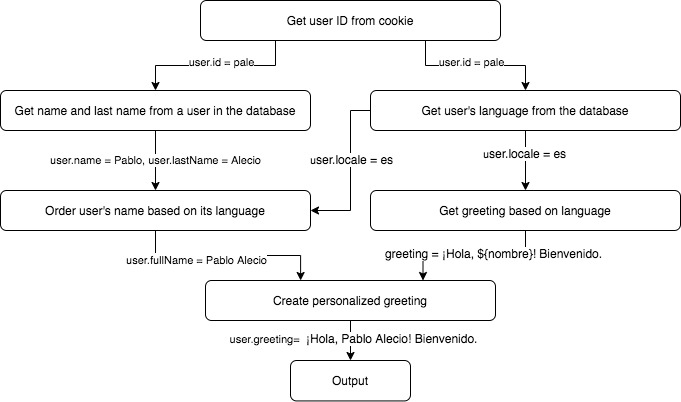
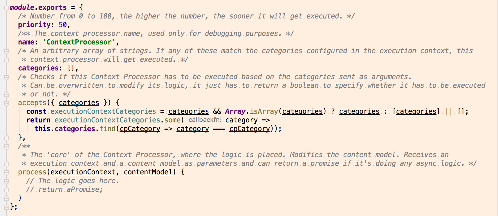

# Nova

Nova is a JavaScript framework based on [XumaK](https://xumak.com)'s [Danta](https://github.com/DantaFramework). It provides a mechanism where the business logic is constructed as modular, granular and reusable pieces called Context Processors, has a simple and clear API which is independent from any particular technology and allows to easily test the logic either piece by piece or several pieces in conjunction.

## Motivation
Even though XumaK's Danta solved many development problems for content management applications of the time,
it still had some areas of improvement. Nova addresses some of these problems _and_ it's written in JavaScript!
Some of the improvements Nova has over Danta are:

- Parallel Context Processor execution
- Context Processors can be simple JavaScript objects, reducing overhead and boilerplate code
- Danta was oriented towards Content Management applications while Nova can be used to create pretty much anything (especially web APIs).

## Install

```bash
npm install @palecio/nova-core
```

## Hello World

```javascript
const nova = require('@palecio/nova-core'); // import framework

nova
  .fetchContextProcessorEngine({ // get a promise that when resolved will return the context processor engine
    contextProcessors: { // the context processor object, can be a single object or an array of objects
      name: 'HelloWorld',
      categories: 'hw',
      process(executionContext, contentModel) { // this is where the context processor logic goes
        contentModel.greeting = 'Hello World';
      }
    }
  })
  .then(contextProcessorEngine => contextProcessorEngine.execute({ categories: 'hw' }, {})) // the execute() method receives an execution context and an initial content model
  .then(contentModel => console.log('Content Model:', contentModel)); // get the resulting content model
```

## Context Processors

Context Processors are small, modular, granular and reusable pieces of code. The results from these Context Processors are values aggregated to a generic stack called
"context". The order of execution determines the final result and there is no way of manipulating the output directly from any specific Context Processor. The context
is a hierarchical stack that stores properties with their values. These properties can be nested and have the concept of "scope". For example, a variable set by a higher
Context Processor will be available in all the following Context Processors and all the modifications to that variable affect the whole scope and all its children A variable
set in a lower Context Processor won’t be available in Context Processors above it so the effects become incrementally granular.
In this way, each processing level adds to the one before and creates unique variables that are available after but won’t conflict with other Context Processor scopes or its children.
Context Processors are meant to be very small and lightweight. They do the least amount of processing needed and rely on following Context Processors to modify their result (if required) into something appropriate.

Context Processors can be dependent or independent. The difference between them, as their name suggests, is that dependent Context Processors depend 
on the result of other Context Processors while the independent ones don't.

To create a dependent Context Processor, just add a 'priority' property to it. To create an independent Context Processor, 
just omit the 'priority' property. 

### Content Model
The Content Model is the object that Context Processors modify when they're executed. Context Processors can add, modify or delete its data. 
It's divided in "Context", which are key value pairs used to group related data. For example, a Content Model can have a context to store the program 
config, another context to store user related data and another one to store the page's content.

Nova Core's Content Model implementation is just a plain JavaScript object that gets passed through all of the accepted Context Processors.

### Execution Context
A JavaScript object that contains data related to the program's execution. For example, the categories to run or in more complex implementations,
the request object. Developers can add data to the Execution Context as needed.

### Context Processor Flow Example


### Anatomy of a Context Processor



## Error Handling
Nova has two types of errors: Fatal and Non Fatal. Fatal errors stop the program execution and throw a JavaScript error. Non Fatal errors just 
log the error to the console and continue the program execution.

Fatal Context processors are useful when there's an error on a Context Processor which writes properties to the Content Model that are used by other 
Context Processors.

## Development Best Practices
- Context Processors should be small. Each Context Processor should do one thing and complex logic should be built using a set of Context Processors.
- Context Processors should be generic, so they can be re-used.
- Context Processors should have a 'name' property to make debugging easier.
- The naming convention for Context Processors is: verb + noun that describe their use. E.g. addImages, getUserID, removeConfiguration.
- Even though the platform allows the use of literal objects as Context Processors, it's recommended that the project's Context Processors are stored on a separate folder, each in its own file; using CommonJS 
modules to export them and the 'require()' function to import them.

---
**Author: Pablo Alecio (paleciop@gmail.com)**
